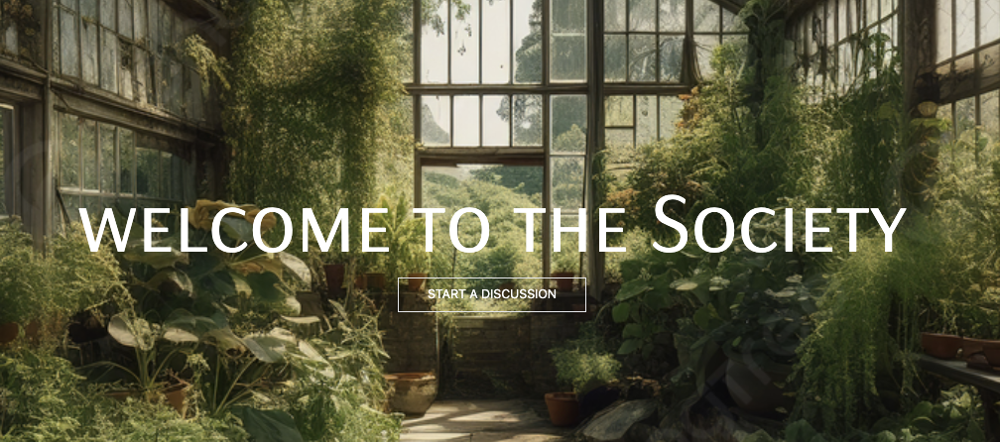

# The Garden Society

A Facebook-style social platform for gardeners — create a profile, share posts and photos, and connect with other growers through comments and discussion topics.

## Screenshot



## Tech Stack

- React 18 + Vite
- React Router (client-side routing, with protected/auth-gated routes)
- Tailwind CSS
- Fetch API, talking to a Django REST backend

## Features

- Register and log in (token-based auth)
- Browse posts on the home feed, filterable by discussion topic
- Create, edit, and view discussion posts
- Comment on posts
- Share photos on posts
- View and edit gardener profiles

## Getting Started

This is the frontend half of a two-repo project — it needs the [Garden Society API](https://github.com/powellniki/gardenproject-api) running locally alongside it.

1. Clone this repo and the [API repo](https://github.com/powellniki/gardenproject-api)
2. Get the API running locally first (see its README) — it should be live at `http://127.0.0.1:8000`
3. Install and run the frontend:
   ```
   npm install
   npm run dev
   ```
4. Visit `http://localhost:5173`

## Pages

| Route | Description |
|---|---|
| `/login`, `/register` | Auth |
| `/` | Home feed, filterable by topic |
| `/posts/:postId` | Post details + comments |
| `/posts/new`, `/posts/:postId/edit` | Create / edit a post |
| `/discussion/topics`, `/discussion/topics/:topicId` | Browse posts by topic |
| `/profile/:gardenerId`, `/profile/:gardenerId/edit` | View / edit a gardener profile |


